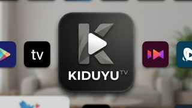

# KiduyuTV

<div align="center">



### Movies, series, Live TV, and native playback—designed for every screen.

KiduyuTV is a Kotlin Android application with dedicated experiences for Android TV, Fire TV, phones, and tablets. One shared codebase combines TMDB discovery, native direct streaming, WebView stream capture, IPTV, watch history, Firebase sync, Trakt, and D-pad-friendly navigation.

[](https://developer.android.com/)
[](https://kotlinlang.org/)
[](https://developer.android.com/compose)
[](https://developer.android.com/media/media3)
[](#build-variants)
[](https://github.com/kiduyu-klaus/KiduyuTv_final/actions/workflows/kiduyu_final.yml)

<br>

[](https://www.paypal.com/cgi-bin/webscr?cmd=_donations&business=kiduyuklaus%40gmail.com&amount=10.00&currency_code=USD&item_name=Buy%20KiduyuTV%20a%20coffee)

</div>

---

## At a glance

- Purpose-built TV and mobile interfaces from one application module.
- Movies and TV shows powered by TMDB metadata, search, collections, cast, recommendations, companies, and networks.
- Native Media3 direct-stream player with HLS, DASH, and progressive playback.
- Provider aggregation, automatic stream ranking, manual source switching, and per-stream headers and cookies.
- Optional Web Sniffer that captures playable media and subtitle requests from provider WebViews.
- Video, audio, embedded subtitle, sniffed subtitle, and SubDL subtitle selection.
- Local Room history plus Firebase synchronization and 15-second playback progress updates.
- IPTV playlists, XMLTV EPG, favorites, schedules, and dedicated Live TV playback.
- Trakt authentication, history, collection, watchlist, recommendations, and scrobbling.
- Firebase authentication, sync, notifications, remote configuration, and update delivery.

## Screenshots

### Discover

<p align="center">
  
  
</p>

<p align="center">
  
  
</p>

### Explore studios and networks

<p align="center">
  
  
</p>

<p align="center">
  
</p>

### Live TV and connected viewing

<p align="center">
  
  
</p>

<p align="center">
  
  
</p>

<details>
<summary><strong>More screens</strong></summary>

<br>

<p align="center">
  
  
</p>

<p align="center">
  
  
</p>

<p align="center">
  
</p>

</details>

## Native direct-stream playback

`DirectStreamActivity` is the preferred native playback path when **Direct Stream** is enabled in Settings. Movie and episode actions bypass provider-selection screens and request aggregate streams from:

```text
kiduyuTv_providers/api/streams/{movie|series}/{tmdbId}
```

Series requests append `season` and `episode`; movie requests do not.

The player supports:

- HLS, DASH, and direct/progressive sources.
- Provider-specific request headers and cookies on manifests, segments, and byte-range requests.
- Automatic selection of the best stream up to **1080p**.
- Manual 1440p and 2160p selection through the Streams dialog.
- A visible buffered range and time-based buffering tuned for high-bitrate media.
- Stream switching while retaining the current playback position.
- Video, audio, and subtitle track dialogs with active-track state.
- SubDL subtitle search by TMDB ID, download, and ExoPlayer loading.
- Sniffed WebVTT and SRT subtitle handoff.
- Fit, fill, zoom, fixed-width, and fixed-height resize modes.
- Play/pause, seek, volume, media-key input, and TV-focusable controls.
- Previous and next episode navigation.
- Backdrop/loading state while streams are fetched or playback buffers.
- Retry and exit behavior when fetching or playback fails.

Playback history is checked locally and in Firebase before media starts. The newest saved position is restored, progress is persisted every 15 seconds, and episode metadata is updated when the viewer moves between episodes.

### Web Sniffer

**Try Web Sniffer** is enabled by default. When the normal WebView flow is used, `WebViewStreamSniffer` watches network requests for playable HLS, DASH, and direct media URLs. It collects the request headers, cookies, and detected SRT/VTT subtitles, then hands the result to `DirectStreamActivity`.

Obvious placeholder media such as `demo-video.mp4` is ignored. If no usable media request is captured, the existing WebView playback flow remains available.

### WebView playback

`PlayerActivity` remains the provider-page player when Direct Stream is disabled. It resolves Firebase-configurable provider templates, blocks common ads and popups, and provides TV cursor navigation where required.

## Browse and organize

### Movies and television

- Trending, popular, top-rated, and now-playing catalogs.
- Movie and TV detail pages with trailers, cast, crew, genres, recommendations, seasons, and episodes.
- Collections, production companies, networks, and curated themed rows.
- Search across movies and television.
- Continue Watching and synchronized watch history.
- My List for movies, shows, companies, networks, and cast shortcuts.

### Live TV

The Live TV area provides:

- M3U playlist loading and streaming parsing.
- XMLTV program-guide data.
- Category browsing and channel search.
- Local and Firebase-synchronized favorite channels.
- Live TV, Schedule, and My Channels tabs.
- Dedicated IPTV and schedule players.
- Configurable scraper addresses for providers whose domains change.

For scraper maintenance and redirect strategies, see [DYNAMIC_SCRAPER_ENDPOINT_GUIDE.md](DYNAMIC_SCRAPER_ENDPOINT_GUIDE.md).

### Trakt

Trakt integration includes OAuth sign-in, profile details, history, collection, watchlist, recommendations, token refresh, synchronization helpers, and movie/episode scrobbling.

## Architecture

```text
Compose UI (TV / Phone)
        │
        ├── ViewModels + StateFlow
        │       ├── TMDB / Trakt repositories
        │       ├── IPTV / schedule repositories
        │       └── Firebase synchronization
        │
        ├── Room cache + watch history
        │
        └── Playback
                ├── DirectStreamActivity
                │       ├── Provider stream API
                │       ├── Media3 PlayerEngine
                │       ├── Stream / track dialogs
                │       └── SubDL subtitles
                ├── WebViewStreamSniffer
                ├── PlayerActivity
                ├── IptvPlayerActivity
                └── SchedulePlayerActivity
```

The application follows an MVVM-style structure:

- Compose screens render immutable state and dispatch user actions.
- ViewModels expose asynchronous state through coroutines and `StateFlow`.
- Repositories coordinate remote services, caching, and domain logic.
- Room stores saved media, history, catalog caches, detail caches, and genres.
- SharedPreferences stores lightweight playback and application settings.
- Firebase synchronizes user data and remote provider configuration.

## Technology

| Area | Technology |
| --- | --- |
| Language | Kotlin |
| UI | Jetpack Compose, Material 3, XML player layouts |
| Navigation | Navigation Compose |
| Playback | Media3 ExoPlayer 1.5.1, HLS, DASH |
| Networking | Retrofit 2.11.0, OkHttp 4.12.0, Volley |
| Async state | Coroutines, Flow, StateFlow |
| Local storage | Room 2.6.1, SharedPreferences |
| Images | Coil, Glide |
| Web content | Android WebView, AndroidX WebKit, Jsoup |
| Cloud | Firebase Auth, Analytics, Realtime Database, Firestore, Messaging |
| Integrations | TMDB, Trakt, SubDL |
| Advertising | StartApp, AdMob, Wortise, Unity, UMP |
| Android | minSdk 24, targetSdk 35, compileSdk 35, Java 17 |

## Project map

```text
app/src/main/
├── java/com/kiduyuk/klausk/kiduyutv/
│   ├── activity/                 # Main and splash activities
│   ├── application/              # Application initialization
│   ├── data/
│   │   ├── api/                  # TMDB and remote APIs
│   │   ├── local/                # Room database and DAOs
│   │   ├── repository/           # Domain repositories
│   │   └── sync/                 # Firebase and Trakt sync
│   ├── ui/
│   │   ├── navigation/           # TV and phone graphs
│   │   ├── player/
│   │   │   ├── directstream/     # Native player, APIs, dialogs, models
│   │   │   ├── webviewsniffer/   # WebView media capture
│   │   │   └── webview/          # Provider WebView player
│   │   ├── screens/              # TV and mobile Compose screens
│   │   └── theme/
│   ├── network/
│   ├── util/
│   └── viewmodel/
├── res/                          # Layouts, drawables, strings, themes
└── assets/                       # WebView filtering rules
```

## Build variants

The `formfactor` flavor dimension produces two applications:

| Flavor | Application ID | Experience |
| --- | --- | --- |
| `phone` | `com.kiduyuk.klausk.kiduyutv.phone` | Touch-first phone and tablet navigation |
| `tv` | `com.kiduyuk.klausk.kiduyutv.tv` | D-pad-first Android TV and Fire TV navigation |

Common build values:

```text
versionName  1.1.71
versionCode  4
minSdk       24
targetSdk    35
compileSdk   35
```

### Local builds

```bash
./gradlew assemblePhoneDebug
./gradlew assembleTvDebug
```

Generated debug APKs are written under:

```text
app/build/outputs/apk/phone/debug/
app/build/outputs/apk/tv/debug/
```

Release variants are available as `assemblePhoneRelease` and `assembleTvRelease`. Production builds require the project's signing configuration.

### Windows desktop application

KiduyuTV also includes a native Windows desktop application in the `desktopApp` module. It is built with Kotlin/JVM and Compose Multiplatform for Desktop, and is distributed as standard Windows **EXE** and **MSI** installers. The Windows package creates a Start Menu entry and desktop shortcut, supports per-user installation, and includes a directory chooser during setup.

The desktop application provides a mouse-and-keyboard-friendly experience for browsing movies and TV shows, searching the catalog, managing My List, using Live TV and schedule views, configuring settings, and opening native playback. It also includes TMDB-backed discovery, IPTV playlist and EPG configuration, Trakt-related screens, local desktop settings, and GitHub release update checks. When a newer release is available, the desktop updater can download the available EXE or MSI installer and launch the appropriate Windows installer.

| Windows package | Use case |
| --- | --- |
| `.exe` | Standard interactive Windows installer. |
| `.msi` | Windows Installer package for managed or enterprise-style deployment. |

To build the desktop distributions locally, use the Compose Desktop packaging tasks from the repository root:

```bash
bash ./gradlew :desktopApp:packageReleaseExe
bash ./gradlew :desktopApp:packageReleaseMsi
```

The desktop module requires Java 17. Its Windows packaging configuration is defined in [`desktopApp/build.gradle`](desktopApp/build.gradle), and the application entry point is `com.kiduyuk.klausk.kiduyutv.desktop.MainKt`.

## Configuration

Before building, configure the services used by your selected features:

| Service | Location |
| --- | --- |
| Firebase | `app/google-services.json` and Firebase console configuration |
| TMDB | `data/api/ApiClient.kt` / the project's secure build configuration |
| Trakt | Trakt client configuration used by `TraktAuthManager` |
| SubDL | Secure API-key configuration consumed by `SubdlSubtitleClient` |
| Stream providers | Firebase `app_config/stream_providers_Configuration` |
| Ads | Manifest placeholders and `app/build.gradle` |

Do not commit production API keys, signing keys, service-account credentials, or private configuration exports.

## Reliability and privacy

- Network monitoring reports connectivity, metered state, VPN, proxy, and DNS conditions.
- WebView filtering uses bundled EasyList, EasyPrivacy, and custom rules.
- Stream failures stay within native playback with retry/exit controls instead of silently changing playback modes.
- Release builds enable code shrinking and resource shrinking.
- Users control Direct Stream, Web Sniffer, synchronization, Trakt, and advertising-related settings.

## License

Copyright © 2026 KiduyuTv. All rights reserved.

This repository and its documentation are proprietary. No permission is granted to use, copy, modify, publish, distribute, sublicense, lease, or sell the software without prior written authorization from the copyright holder. See [LICENSE](LICENSE) for the complete terms.
